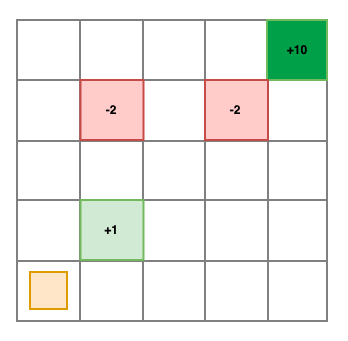
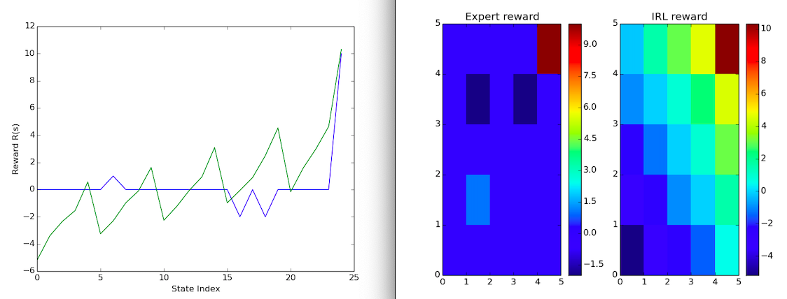

Workspace for collaborating on the ASEN 5519 (Decision Making Under Uncertainty) Project.

Contributors:
* Alexa Reed
* Sourav Chakraborty 
* Tuhina Tripathi

The project has three major components:

* Value Iteration: ValueIteration.py
* MAxEnt IRL: maxEntIRL.py
* User Interface: https://github.com/souravchk25/dmu-interface/tree/master

We have implemented the proposed approach on a 5X5 gridworld. The environment is as follows:

Our final results show how the learned reward compares to the true reward for the MDP

#### To run the code:

Run the file 'test.py' and it will compute the expert policy, generate trajectories, and get the IRL rewards for the MDP.  